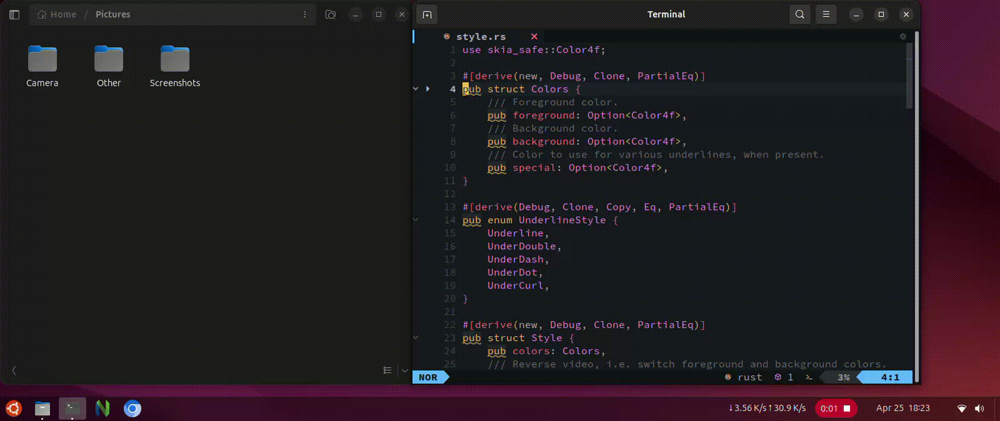

<div align="center">
<h1>silicon.nvim</h1>
<div>A minimal Neovim plugin that generates code snapshots using silicon, supporting file, line, and visual selection exports with customizable styling and layout.</div>
</div>



---

### ✨ Features

- Export entire file, current line, or visual range
- Uses [silicon](https://github.com/Aloxaf/silicon) under the hood
- Custom output path and filename format
- Fully configurable appearance:
  - Background color
  - Window title
  - Padding (horizontal & vertical)
  - Line numbers offset
  - Tab width
  - Line padding
  - Shadow settings

---

### 📦 Requirements
- [`silicon`](https://github.com/Aloxaf/silicon) must be installed and available in system.

---

### ⚙️ Installation

Using `lazy.nvim`:

```lua
{
  "ankushbhagats/silicon.nvim",
  config = true,
}
```

Using `packer.nvim`:

```lua
use {
  "ankushbhagats/silicon.nvim",
  config = function()
    require("silicon").setup()
  end
}
```

### Commands
Export the entire current file.

```
:SiliconFile [title]
```

Export the current line.

```
:SiliconLine [title]
```

Export selected visual range.

```
:'<,'>SiliconRange [title]
```

### 📁 Output
By default, images are saved to:
```
~/Pictures/snapshot_YYYY-MM-DD_HH-MM-SS.png
```

You can customize this:

```lua
output = {
  path = "~/Screenshots",
  format = function()
    return "code_" .. os.date("%Y%m%d_%H%M%S") .. ".png"
  end,
}
```

### ⚙️ Configuration

```lua
require("silicon").setup({
  output = {
    path = "~/Pictures",
    format = function()
      return "snapshot_" .. os.date("%Y-%m-%d_%H-%M-%S") .. ".png"
    end,
  },

  args = {
    background = "#fff0",
    window_title = function()
      return vim.fn.expand("%:t")
    end,

    line_pad = 2,
    tab_width = 4,

    pad_horiz = 80,
    pad_vert = 100,

    shadow_blur_radius = 0,
    shadow_offset_x = 0,
    shadow_offset_y = 0,
    shadow_color = "#000000",

    line_offset = 1,
  },
})
```
